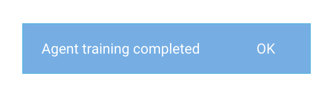

# Бот поддержки ВКонтакте

Ссылка на бота: [https://vk.com/feedbacked](https://vk.com/feedbacked)


Замысел:
1. Выкачать наиболее частые вопросы со страницы поддержки ВК
2. Написать бота для быстрого ответа на частые вопросы
3. Запустить бота ВКонтакте

Базовая статья: [DialogFlow](https://habr.com/post/346606/)

## Этап 1

Файл ``` load.py ``` - загрузка вопросов и ответов, опубликованных в поддержке ВК (Общие и API). Загружаем в файл ``` answers.json ```.

Параметр | Значение
---|---
``` question ``` | Вопрос
``` answer ``` | Ответ
``` section ``` | Раздел вопроса (``` home ``` / ``` home_api ```)
``` category ``` | Название категории
``` category_id ``` | ID категории вопроса в разделе
``` id ``` | ID вопроса в категории


## Этап 2

### DialogFlow



Загруженные вопросы записываем как Intents в DialogFlow c помощью ``` dialogflow_feedback/create.py ```. Теперь если задавать точь-в-точь такой же вопрос - будет выдан ответ. Но этого недостаточно. Задаём несколько вопросов системе, в разделе Training подтверждаем предполагаемые категории. Запускается переобучение.

В файле ``` dialogflow_main.py ``` содержится код для получения ответов по обученным данным. В случае если ответ не найден, то вопрос сохраняется, а пользователя перенаправляют на подробное описание проблемы.

Попутные статьи:
1. [Google API](https://cloud.google.com/dialogflow-enterprise/docs/reference/rest/v2beta1/projects.agent.intents/create)
2. [DialogFlow API](https://dialogflow.com/docs/reference/agent/intents)


## Этап 3

Файл ``` bot.py ``` запускает [бота](https://vk.com/feedbacked).

Пример работы на некоторых обученных данных, которых изначально не было:

